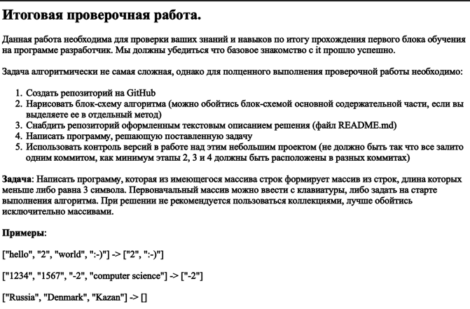

# Итоговая проверочная работа за 1 четверть.

1. Подготовлен репозиторий `Final_Test_1_quarter` в GitHub;
***
2. Нарисована схема алгоритма метода основного блока задачи `Схема_алгоритма_задачи.png`. включена в GitHub;

Алгоритм отдельно загружен в Drawio
***
3. Создан файл `Readme.md` с кратким описанием выполненого задания;
***
4. Подготовлена папка `Task_solution` с программой решающей задачу. Выгружена в GitHub;
***
